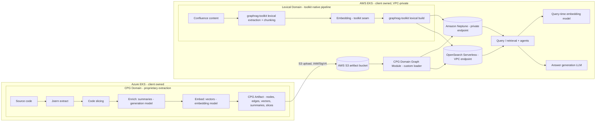

# Interim Cross-Cloud Architecture — Azure Extract → AWS Build & Query
## graphrag-toolkit / CPG-RAG migration (Neo4j → Amazon Neptune)

- **Status:** Proposal for client review
- **Audience:** Client architecture & security stakeholders; AWS; Deloitte
- **Date:** 2026-07-07 (revised)
- **Companion decisions:** ADR-0002…ADR-0010

---

## 1. Purpose
Propose the topology for migrating the client's code-property-graph (CPG) and knowledge-graph workloads off self-hosted Neo4j onto AWS (Amazon Neptune + Amazon OpenSearch), during an active Azure → AWS migration. Core recommendation — a clean responsibility split:

> **Azure produces extract artifacts; AWS owns build and query.**
> Azure delivers JSON artifacts to Amazon S3; AWS builds the graph and serves retrieval. All graph/vector infrastructure remains private within the AWS VPC.

## 2. Executive summary
- Joern extraction and enrichment remain in Azure EKS, reusing the client's existing process and models. Joern emits JSON (nodes + edges) — not a graph load — which is the natural hand-off.
- The client's process is repointed from "load into Neo4j" to "stage an artifact in S3": CPG JSON + semantic summaries (text) + a manifest.
- AWS runs the graphrag-toolkit build (S3 → Neptune + OpenSearch) and the query/retrieval + agents — deployed to the client's **AWS EKS cluster**, within the VPC.
- No toolkit code changes — this is a deployment/topology decision.
- Neptune and OpenSearch remain **private** (VPC). The only cross-cloud transfer is the S3 artifact upload (standard IAM/SigV4 authenticated).
- The client operates **two EKS clusters** during the migration: Azure EKS (extraction workloads) and AWS EKS (build/query workloads). Over time, workloads migrate from Azure EKS to AWS EKS.

## 3. Context & constraints
- The client is migrating Azure → AWS; Neo4j → Neptune is one workstream of that move.
- Current stack (self-hosted, mostly Azure): Joern → JSON → Neo4j; enrich in Neo4j; embed; store vector-in-graph. Local Ollama models (generation + embedding). Azure Cosmos (MongoDB API) for agent orchestration.
- Amazon Neptune is VPC-private by default. This architecture keeps it that way.
- Amazon OpenSearch Serverless can be configured with VPC endpoints for private access.
- The graphrag-toolkit is AWS-native; it connects to Neptune via the neptunedata HTTPS API with SigV4 and to OpenSearch Serverless via SigV4 — both from within the VPC.
- S3 supports IAM/SigV4 authenticated uploads from anywhere — this is the standard cross-cloud hand-off mechanism.

## 4. Design principles (traceable to ADRs)
1. Extraction is external; build is the toolkit's. (ADR-0006)
2. Graph = truth, embeddings = entry points; stores separated; write strategy is store-agnostic. (ADR-0003, ADR-0004)
3. The toolkit owns vectorization; the client's models are injected via the model seam. (ADR-0005, ADR-0007)
4. One-way dependency; the bespoke layer is insulated from toolkit churn. (ADR-0009)
5. Cloud strategy is native-trending; Neptune and OpenSearch stay private in VPC. (ADR-0008)
6. Cross-cloud seam is S3 only — a bulk artifact transfer, not chatty graph writes. (ADR-0006, ADR-0010)

## 5. The architecture — the responsibility split

### 5.1 Graph domains

The client operates **two distinct graph domains** — each follows a different path:

| Graph Domain | Source | Strategy | Why |
|---|---|---|---|
| **CPG domain graph** | Source code repos | Client extracts in Azure → portable JSON artifact → AWS loads | Proprietary Joern/CPG process; client investment preserved; no toolkit customization for extraction |
| **Lexical graph** | Confluence, documents | **Runs entirely in AWS** using graphrag-toolkit native pipeline | The toolkit already has a production lexical graph pipeline (document-graph). No reason to customize the toolkit for a proprietary extract when it handles this natively. |

**Key distinction:**
- CPG: The toolkit does NOT own extraction — the client's Joern process is proprietary and stays in Azure. Deloitte builds a custom Domain Graph Module to load the portable artifact.
- Lexical: The toolkit DOES own extraction, build, and query — it already does this. Confluence content is made accessible to AWS (API access or content export). The entire pipeline runs in AWS EKS.

### 5.2 Boundary — who does what, where

| Concern | Runs in | Owner | Notes |
|---|---|---|---|
| **CPG Domain (proprietary extraction → portable artifact → AWS load)** | | | |
| Joern extraction → CPG nodes/edges | Azure EKS | Client | Proprietary process; emits structured JSON |
| Code slicing (snippets, line ranges) | Azure EKS | Client | Evidence slices for grounded retrieval |
| Per-node enrichment (summaries via generation model) | Azure EKS | Client | Multi-model: generation model produces summaries |
| Embedding generation (vectors for nodes/summaries) | Azure EKS | Client | Multi-model: embedding model produces vectors |
| Stage CPG artifact to S3 | Azure EKS → S3 | Client | Portable JSON boundary (section 6) |
| CPG build (load artifact → Neptune + OpenSearch) | AWS EKS (in-VPC) | Deloitte (toolkit) | Custom Domain Graph Module; deterministic load |
| **Lexical Domain (entirely AWS-native — toolkit pipeline)** | | | |
| Confluence content access | AWS EKS | Client (config) | API access to Confluence or content export to S3 |
| Lexical extraction + chunking | AWS EKS (in-VPC) | Deloitte (toolkit) | graphrag-toolkit native document-graph pipeline |
| Embedding generation | AWS EKS (in-VPC) | Deloitte (toolkit) | Uses toolkit's embedding seam; model hosted in AWS |
| Lexical build (graph + vectors → Neptune + OpenSearch) | AWS EKS (in-VPC) | Deloitte (toolkit) | graphrag-toolkit native build |
| **Query & Runtime (both domains)** | | | |
| Query / retrieval / agents | AWS EKS (in-VPC) | Client (infra) + Deloitte (toolkit) | Reads Neptune + OpenSearch across both graph domains |
| Query-time embedding (vectorize user question) | AWS EKS (in-VPC) | Client (model) + Deloitte (toolkit) | Must match stored vector space |
| Answer generation (LLM) | AWS EKS (in-VPC) | Client (model) + Deloitte (toolkit) | Response generation from evidence |

The only cross-cloud seam is the **CPG artifact upload to S3**. The lexical domain never leaves AWS.

### 5.3 Data flow


- **CPG domain**: crosses the cloud boundary once (S3 artifact upload). Build is a custom loader.
- **Lexical domain**: never leaves AWS. The graphrag-toolkit's native document-graph pipeline handles extraction, build, and query entirely within AWS EKS.
- **Query layer**: unified across both domains — graph traversal + vector search over the combined graph.

### 5.4 Compute topology — two EKS clusters

| Cluster | Cloud | Owner | Workloads | Lifecycle |
|---|---|---|---|---|
| Azure EKS | Azure | Client | CPG extraction + enrichment + embedding; S3 upload | Existing; CPG extraction migrates to AWS EKS over time |
| AWS EKS | AWS | Client | Lexical pipeline (toolkit native); CPG Domain Graph Module (build); query/retrieval; agents; embedding model; LLM | New; provisioned for this workload; grows as Azure workloads migrate |

- The **client owns and operates both EKS clusters** — infrastructure, configuration, scaling, and networking.
- The **client owns the multi-model extraction pipeline** in Azure EKS (generation model for summaries, embedding model for vectors) for both CPG and Lexical domains.
- **Deloitte delivers** the graphrag-toolkit containers/Helm charts (Domain Graph Module) that run in the client's AWS EKS.
- **AWS provisions** the backing services (Neptune, OpenSearch, S3) that the AWS EKS workloads connect to.
- Over time, the client migrates extraction and enrichment workloads from Azure EKS to AWS EKS. The architecture supports this with no changes — only the S3 upload step becomes a local (in-VPC) operation instead of cross-cloud.

### 5.3 Why Neptune and OpenSearch must remain private — no public endpoint build

**Building a graph and vector index over a public endpoint from one cloud provider to another is not production-viable.** This is a fundamental architectural constraint, not a preference:

1. **Write amplification over WAN:** A graph build is not a single bulk load — it is thousands of individual mutations (node creates, edge creates, property updates, vector inserts). Each write is a round-trip. Over a public endpoint from Azure to AWS, every round-trip incurs 20–80ms of WAN latency. A build that takes minutes in-VPC would take hours over the internet.

2. **Transient failure at scale:** Public internet connections experience packet loss, TCP resets, DNS failures, and throttling. A build performing thousands of sequential writes will hit these failures repeatedly. Retry logic helps, but the error rate makes the process unreliable for production workloads.

3. **Data transfer cost:** Graph builds are write-heavy in both directions (request + response for every mutation). Cross-cloud egress is billed on both sides. At hundreds of repos, this becomes a material ongoing cost for no architectural benefit.

4. **Security exposure of a proprietary graph:** A code-property-graph containing proprietary source code structure, control flow, and semantic summaries — accessible over the public internet — is an unacceptable security posture for production, regardless of IAM gating. Defense-in-depth requires network-layer isolation.

5. **No resilience guarantee:** Neptune public endpoints are positioned by AWS as a dev/test convenience. Failover behavior with public endpoints has caveats (role-swap breaks writer accessibility). This is not a foundation for a production build pipeline.

**The correct pattern:** Ship the artifact (JSON) to S3 in one bulk transfer, then build locally within the AWS VPC where Neptune and OpenSearch are milliseconds away over private networking. This is faster, cheaper, more reliable, and more secure.

### 5.4 What actually crosses the cloud boundary

Only **one thing** crosses from Azure to AWS: the S3 artifact upload.

| Cross-cloud? | Operation | Protocol | Notes |
|---|---|---|---|
| ✅ Yes | Artifact upload (JSON files → S3) | HTTPS, IAM/SigV4 | One bulk transfer per repo per job. Standard pattern. |
| ❌ No | Graph writes (nodes, edges, properties) | Private VPC | Thousands of mutations — must be local to Neptune |
| ❌ No | Vector inserts (embeddings → OpenSearch) | Private VPC | Must be local to OpenSearch |
| ❌ No | Query / retrieval | Private VPC | Must be co-located with graph + vectors |

## 6. The hand-off contract (the S3 artifact)

The client produces a **portable JSON domain graph artifact** — a complete, self-describing bundle that allows AWS to reconstruct the graph and vector enrichment without participating in extraction or embedding.

### 6.1 CPG artifact structure
A per-repo, per-job bundle:

```
s3://<bucket>/cpg-exports/<repo>/<job_id>/
  manifest.json       # artifact type, schema version, repo, commit, embedding model, dimensions, vector strategy
  nodes.jsonl         # CPG nodes with stable identifiers (not Neo4j internal IDs)
  edges.jsonl         # CPG relationships between stable node IDs
  vectors.jsonl       # precomputed vectors with embedding metadata
  summaries.jsonl     # method/file/slice summaries
  code_slices.jsonl   # code snippets, line ranges, evidence slices
  findings.jsonl      # scanner/security findings (if available)
  lineage.jsonl       # analysis run, repo, commit, source artifact metadata
```

### 6.2 Lexical domain — no artifact needed
The lexical graph does **not** use the portable JSON artifact pattern. The graphrag-toolkit's native document-graph pipeline handles extraction, chunking, embedding, and build internally. The client only needs to make Confluence content accessible to the AWS EKS cluster (API access or content export to S3).

This is intentional: it makes no sense to customize the AWS graphrag-toolkit for a proprietary extraction process when the toolkit already handles lexical/document content natively and better.

### 6.3 Why vectors are in the artifact (not generated in AWS)
The client currently generates embeddings as part of their enrichment process (vector-in-graph pattern in Neo4j). This does not change. The client ships **precomputed vectors** in `vectors.jsonl`. Consequences:

- **AWS build does NOT need the client's embedding model.** The graph and vector load is deterministic — no model inference at build time.
- **AWS query DOES need a compatible embedding model** to vectorize user questions at query time (same model, same dimensions, same similarity function).
- **The manifest declares** the embedding model, dimensions, and similarity function — AWS validates compatibility before loading.
- **If the client changes their embedding model**, all vectors must be regenerated and the artifact re-shipped (the manifest version forces a full re-ingest).

### 6.4 Key contract requirements
| Requirement | Purpose |
|---|---|
| Stable `cpg_node_id` (not Neo4j internal IDs) | Portable cross-system identity; join key between graph and vectors |
| `embedding_model` + `embedding_dimensions` + `similarity_function` in manifest | AWS validates vector index compatibility |
| `code_hash` on nodes | Enables delta detection (skip unchanged code) |
| `analysis_run_id` in lineage | Tracks which extraction/enrichment run produced the artifact |
| `embedding_target` on each vector | Describes what was embedded (raw code, summary, slice, finding) |
| Provenance fields (repo, commit, file, line_start, line_end) | Evidence traceability |
| Schema version in manifest | Contract evolution without breaking changes |

### 6.5 What changed from Neo4j
The client's process is identical except the persistence boundary:

| Current (Neo4j) | Target (Portable JSON) |
|---|---|
| Write CPG nodes to Neo4j | Write CPG nodes to `nodes.jsonl` |
| Write CPG edges to Neo4j | Write CPG edges to `edges.jsonl` |
| Store vectors as Neo4j node properties | Write vectors to `vectors.jsonl` |
| Store summaries on Neo4j nodes | Write summaries to `summaries.jsonl` |
| Store code snippets in Neo4j | Write code slices to `code_slices.jsonl` |
| Neo4j is the integration boundary | Portable JSON is the integration boundary |

The orchestration remains the same. Only the database-specific writer changes.

## 7. Networking & connectivity

### 7.1 Primary architecture (recommended)
- **Azure EKS → S3:** Write artifacts over S3's public endpoint with IAM/SigV4. Standard pattern — no special networking required.
- **Neptune:** Private endpoint within VPC. Accessible only from the client's AWS EKS pods (via VPC networking).
- **OpenSearch Serverless:** VPC endpoint. Accessible only from the client's AWS EKS pods.
- **AWS EKS → Neptune/OpenSearch:** Pods run in VPC subnets with direct private access to Neptune and OpenSearch. No internet traversal.
- **AWS EKS → S3:** Via S3 gateway endpoint (free, no NAT required).

### 7.2 Credential flow (Azure EKS → S3)
- Azure EKS → AWS IAM credentials via workload-identity federation (OIDC) to an AWS IAM role — not static keys.
- The IAM role has `s3:PutObject` permission on the artifact bucket only. No access to Neptune or OpenSearch.
- TLS in transit; CloudTrail audit on the S3 bucket.

### 7.3 Credential flow (AWS EKS → Neptune/OpenSearch)
- AWS EKS pods use IAM Roles for Service Accounts (IRSA) — Kubernetes service accounts mapped to IAM roles.
- IAM roles scoped to Neptune and OpenSearch access only.
- No static credentials in pod environment variables.

### 7.4 Migration trajectory
As the client migrates workloads from Azure EKS to AWS EKS:
- Extraction and enrichment move to AWS EKS.
- The S3 upload becomes a local VPC operation (S3 gateway endpoint) instead of cross-cloud.
- No architecture changes required — the same containers, same artifact format, same S3 bucket.
- Azure EKS can be decommissioned when all workloads have migrated.

## 8. Security posture
- **Neptune:** Private VPC endpoint. No public access. IAM DB auth enabled. Security group allows only AWS EKS pod subnets.
- **OpenSearch Serverless:** VPC endpoint. Data-access policy scoped to AWS EKS pod IAM roles (IRSA).
- **S3 artifact bucket:** IAM/SigV4. Bucket policy allows PutObject from Azure workload role only. Versioning + KMS encryption.
- **No cross-cloud access to graph stores.** Azure EKS never talks to Neptune or OpenSearch directly.
- **Credentials:** Azure EKS → AWS via OIDC federation (no static keys). AWS EKS pods use IRSA (IAM Roles for Service Accounts).
- **Audit:** CloudTrail on all API calls; S3 access logging; Neptune audit logs enabled.

## 9. Model hosting (ADR-0007) — a consequence of the split

Because the CPG domain ships **precomputed vectors** in the artifact, and the lexical domain runs natively in AWS, the model dependencies differ per domain:

### 9.1 CPG domain (precomputed vectors)
| Stage | Needs embedding model? | Needs generation model? | Where |
|---|---|---|---|
| Extraction (Joern) | No | No | Azure EKS |
| Enrichment (summaries) | No | Yes (generation) | Azure EKS |
| Embedding generation | Yes | No | Azure EKS |
| CPG build (graph + vector load) | **No** | **No** | AWS EKS |
| CPG query-time embedding | **Yes** | No | AWS EKS |
| CPG answer generation | No | **Yes** | AWS EKS |

### 9.2 Lexical domain (toolkit-native, all in AWS)
| Stage | Needs embedding model? | Needs generation model? | Where |
|---|---|---|---|
| Lexical extraction + chunking | No | Yes (summarization) | AWS EKS |
| Lexical embedding | Yes | No | AWS EKS |
| Lexical build | No | No | AWS EKS |
| Lexical query-time embedding | Yes | No | AWS EKS |
| Lexical answer generation | No | Yes | AWS EKS |

### 9.3 Model deployment summary
| Model | Azure EKS | AWS EKS | Purpose |
|---|---|---|---|
| Generation (e.g. Mistral 7B) | ✅ CPG enrichment | ✅ Lexical extraction + answer generation | Summaries, answers |
| Embedding (e.g. nomic-embed) | ✅ CPG vector generation | ✅ Lexical build + query-time (both domains) | Vectors |

The client is responsible for deploying models in both clusters. Models are injected through the toolkit's provider seam (LLM / BaseEmbedding), which is provider-neutral.

## 10. Toolkit deployment topology in AWS EKS — three personalities

The graphrag-toolkit is deployed as **one container image** with **three runtime personalities** in the client's AWS EKS cluster. Same code, different configuration — scaled independently:

| Personality | Role | Scaling Pattern | Config |
|---|---|---|---|
| **Extract** | Lexical extraction + chunking + embedding from Confluence | Job-based (batch); scales with content volume | `TOOLKIT_MODE=extract`; needs generation + embedding model access; reads Confluence API |
| **Build** | Load artifacts into Neptune + OpenSearch (CPG from S3; lexical from extract output) | Job-based (batch); scales with artifact volume | `TOOLKIT_MODE=build`; needs Neptune + OpenSearch write; reads S3 |
| **Query** | Serve retrieval requests (graph traversal + vector search + answer generation) | Request-based (HPA); scales with query traffic | `TOOLKIT_MODE=query`; needs Neptune + OpenSearch read; needs embedding + LLM model access |

### 10.1 Why split into personalities
- **Independent scaling:** Extract and build are batch/job workloads (bursty, CPU/memory heavy). Query is a long-running service (latency-sensitive, horizontally scalable).
- **Isolation:** A build job consuming resources does not degrade query latency.
- **Security:** Build has write access to Neptune/OpenSearch; query has read-only access. Least-privilege per pod via IRSA.
- **Lifecycle:** Extract runs when new content arrives. Build runs when new artifacts land in S3. Query runs continuously.

### 10.2 Deployment in EKS
```
AWS EKS Cluster (client-owned)
├── namespace: graphrag-extract
│   └── Job/CronJob: toolkit (mode=extract)
│       → reads Confluence API
│       → writes extracted chunks to internal staging (S3 or local)
│       → needs: generation model, embedding model
│
├── namespace: graphrag-build
│   └── Job: toolkit (mode=build)
│       → reads S3 artifacts (CPG portable JSON + lexical extract output)
│       → writes to Neptune (private) + OpenSearch (VPC endpoint)
│       → needs: Neptune write, OpenSearch write
│
├── namespace: graphrag-query
│   └── Deployment (HPA): toolkit (mode=query)
│       → reads Neptune (private) + OpenSearch (VPC endpoint)
│       → needs: embedding model (query-time), generation model (answers)
│       → serves retrieval API to agents
│
└── namespace: models
    ├── Deployment: embedding-model (e.g. Ollama + nomic-embed)
    └── Deployment: generation-model (e.g. Ollama + Mistral 7B)
```

### 10.3 IRSA (IAM Roles for Service Accounts) per personality
| Personality | IAM Permissions |
|---|---|
| Extract | S3 read/write (staging), Confluence API (external) |
| Build | S3 read (artifacts), Neptune write, OpenSearch write |
| Query | Neptune read, OpenSearch read — **no write access** |

## 10. Multi-tenancy & identity (ADR-0002)
- Logical separation via the toolkit's TenantId (label + index-name encoding) within a single Neptune cluster and OpenSearch collection — no per-project database.
- Recommended granularity: tenant per repo (or repo+version), grouped into a Project by a naming convention; a deterministic derivation maps repo identity to a valid TenantId (<= 25 lowercase chars). Bounds delta-replace blast radius to one repo.

## 11. Delta / idempotency (ADR-0004, ADR-0005)
- The build is skip-or-replace: unchanged repos are skipped (zero writes); changed repos are re-ingested under a new tenant and the prior tenant purged.
- The manifest signature keys on method signatures + enrichment recipe version, so improving the summariser forces re-ingest rather than silently serving stale overlay.

## 12. Store topology (ADR-0003, ADR-0004)
- Recommended: Neptune Database (durable graph truth) + OpenSearch Serverless (vectors).
- The overlay write strategy is store-agnostic: external-vector (OpenSearch) or vector-in-graph (Neptune Analytics). At hundreds-of-projects scale, Neptune DB + OpenSearch is the default; Neptune Analytics is reserved for on-demand analytics.

## 13. Toolkit vs bespoke, and future-proofing
- Reused from the toolkit (no rebuild): build pipeline, embedding, storage, checkpoint/extraction format.
- Bespoke (CPG-RAG): the "compiler" that turns the CPG into semantic summaries, and the federation that links the code graph to the document/knowledge graph.
- Future-proofing (cheap, structural): preserving provenance, stable identity, temporal versioning, and using the multi-source-capable ingest path costs little now and keeps future evidence/analytics capabilities open. Not built in this phase; simply not foreclosed.

## 14. Risks & mitigations
| Risk | Mitigation |
|---|---|
| S3 upload failure from Azure | Retry with exponential backoff; manifest checksums for integrity validation |
| Embedding model unreachable from build | Host embedding model in AWS (co-located with build in same VPC) |
| Embedding dimension mismatch | Confirm model dimension; set embed_dimensions; contract test |
| Toolkit churn breaks bespoke layer | Pin versions; adapter layer; contract tests (ADR-0009) |
| Stale overlay after summariser change | Enrichment recipe version in the manifest |
| Build throughput at scale | Size compute to expected volume; S3 event-driven triggers; parallelism |
| Credential leak (Azure OIDC role) | Scope to s3:PutObject on one bucket only; no Neptune/OpenSearch access |

## 15. Phasing
- Phase 1 (this document): migrate off Neo4j to Neptune/OpenSearch via the split; Neptune and OpenSearch private in VPC; graphrag-toolkit deployed to client's AWS EKS. Done future-ready (provenance/identity/time preserved).
- Phase 2 (proposed after Phase 1): federate the code graph with the document/knowledge graph.
- Phase 3 (over time): client migrates extraction/enrichment from Azure EKS to AWS EKS. No architecture change required.
- Later capability is out of scope here and proposed separately.

## 16. Ownership summary

| Component | Owner | Responsibility |
|---|---|---|
| Azure EKS cluster | Client | Provision, configure, operate, scale |
| Azure workloads (Joern, enrichment, S3 upload) | Client | Develop, deploy, operate |
| AWS EKS cluster | Client | Provision, configure, operate, scale, networking |
| AWS infrastructure (Neptune, OpenSearch, S3, IAM) | AWS | Provision, configure, maintain |
| graphrag-toolkit customization (containers, Helm charts) | Deloitte | Develop, deliver, support |
| Deployment of toolkit to AWS EKS | Client | Deploy containers/charts to their EKS |
| Embedding model (AWS EKS) | Client | Deploy, operate, scale |
| Generation model (Azure EKS) | Client | Existing; no change |
| Architecture approval | Client | Review, decide, sign-off |

## 17. Decisions we need from the client
1. Confirm the embedding model and its vector dimension.
2. Enrichment: per-node (fits the single build pass) or traversal-based (adds an in-AWS post-load pass)?
3. Tenant granularity and the Project→repo grouping convention.
4. Expected volume (repos/projects) — sizes the build throughput.
5. Build trigger preference: S3 event-driven (automatic) or scheduled/manual?
6. AWS EKS cluster configuration: node instance types, scaling policy, namespaces for toolkit workloads.
7. Timeline for migrating extraction/enrichment from Azure EKS to AWS EKS.

## Appendix A — Decision record index
ADR-0002 Tenant strategy; ADR-0003 Store topology; ADR-0004 Store-agnostic write; ADR-0005 Embedding ownership; ADR-0006 External extraction / toolkit build; ADR-0007 Model providers & in-AWS hosting; ADR-0008 Cloud strategy; ADR-0009 Dependency discipline; ADR-0010 Cross-cloud seam (S3 artifact).

---

## Appendix B — Contingency: Public endpoints (if Azure must query Neptune directly)

> **This section applies ONLY if the client requires Azure-based agents or queries to read from Neptune/OpenSearch directly during the migration — i.e., before query compute moves to AWS. This is NOT the recommended path.**

If this contingency is needed:
- Neptune engine >= 1.4.6.x supports public endpoints (IAM auth mandatory).
- All instances must be publicly accessible (failover safety).
- Security-group allowlist to Azure EKS egress CIDR only.
- OpenSearch Serverless public network policy + SigV4 data-access policy.
- Time-boxed with a documented sunset date. Disable public access once query compute moves to AWS.
- See ADR-0010 for full requirements, risks, and caveats.

**Client decisions required for this contingency:**
1. Is public-endpoint use acceptable to security/governance (any SCP on public Neptune)?
2. Neptune HA required during the interim (drives all-instances-public exposure)?
3. Target date for the sunset to private endpoints.
