# Federated Semantics Graph Architecture

**Document status:** Draft for client alignment  
**Audience:** Client architects, platform engineers, GraphRAG developers, security engineering, and application-security teams  
**Scope:** Combining Confluence multimodal content, Code Property Graphs, SBOM/CVE/scanner evidence, and domain inventory into one retrieval and reasoning architecture


## 1. Executive Summary

The client requirement combines two different information types:

1. **Confluence and documentation data** — human-authored pages, diagrams, images, tables, attachments, runbooks, and design notes. (Targeted for MVP1, prototype delivered)
2. **Source-code-derived Code Property Graph data** — AST, call graph, control flow, data flow, methods, classes, endpoints, source/sink paths, and vulnerability-relevant program behavior. (Partial target delivered for MVP1, prototypes delivered)

These should not be forced into a single extraction model.

The recommended architecture is a **Federated Semantics Graph**: (Targeted MVP2)

- Confluence is modeled as a **Multimodal Lexical Semantics Graph**. (Targeted MVP1, Neo4j solution delievered)
- Source code is modeled as a **Program Semantics Graph**, implemented through a **Code Property Graph** and semantic overlay. (Targeted MVP1)
- SBOM, CVEs, scanner results, tickets, exceptions, and attestations are modeled as an **Evidence Semantics Graph**. (Targeted MVP2)
- Applications, repositories, APIs, services, owners, controls, risks, and findings are modeled as the **Domain Semantics Graph**. (Targeted MVP1, Neo4j solution delivered)
- The Domain Semantics Graph serves as the canonical identity spine connecting the other graph families.

The retrieval pattern is **Multi-Graph RAG**: a query planner selects the appropriate graph/index, performs vector search only as an entry point, traverses graph relationships to find evidence, and produces answers with provenance back to source documents, code locations, and evidence artifacts. (Targeted MVP2)


## 2. Architecture Principle

> Do not collapse Confluence, source code, SBOM/CVE data, and findings into one flat graph.
>
> Keep each graph specialized, then join them through canonical domain identity and typed evidence relationships.

The system should preserve three separate kinds of truth:

| Truth Type | Source | Graph Family | Role |
|---|---|---|---|
| Lexical truth | Confluence, documents, diagrams, images, attachments | Multimodal Lexical Semantics Graph | What the documentation says |
| Program truth | Source code and Code Property Graph | Program Semantics Graph | What the code does |
| Evidence truth | SBOM, CVE, scanners, tickets, exceptions, attestations | Evidence Semantics Graph | What evidence exists |
| Domain truth | CMDB, service catalog, app inventory, ownership, controls | Domain Semantics Graph | What business/security object this is |


## 3. Terminology

Root family     → Semantics Graph
Graph families  → Lexical / Program / Domain / Evidence
Instances       → Multimodal Lexical Graph, Code Property Graph, Domain Identity Graph, Evidence Graph
Pattern         → Federated Semantics Graph / Multi-Graph RAG

| Source                                  | Graph family              | Instance                                    |
| --------------------------------------- | ------------------------- | ------------------------------------------- |
| Confluence, docs, diagrams, images      | Lexical Semantics Graph   | Multimodal Lexical Semantics Graph          |
| Source code / CPG                       | Program Semantics Graph   | Code Property Graph + Semantic Code Overlay |
| Apps, repos, services, APIs, controls   | Domain Semantics Graph    | Canonical Domain / Identity Graph           |
| SBOM, CVE, scans, tickets, attestations | Evidence Semantics Graph  | Evidence / Provenance Graph                 |
| End-to-end retrieval                    | Federated Semantics Graph | Multi-Graph RAG                             |


## 4. Graph Family Taxonomy

```mermaid
graph TD
    SG[Semantics Graph Family]

    SG --> LSG[Multimodal Lexical Semantics Graph]
    SG --> PSG[Program Semantics Graph]
    SG --> DSG[Domain Semantics Graph]
    SG --> ESG[Evidence Semantics Graph]

    LSG --> CONF[Confluence Pages]
    LSG --> DOCS[Documents / PDFs]
    LSG --> IMG[Images / Diagrams]
    LSG --> TABLES[Tables / Attachments]

    PSG --> CPG[Code Property Graph]
    PSG --> AST[AST]
    PSG --> CFG[Control Flow]
    PSG --> DDG[Data Flow]
    PSG --> CALLS[Call Graph]

    DSG --> APP[Application]
    DSG --> API[API Endpoint]
    DSG --> REPO[Repository]
    DSG --> CTRL[Control]
    DSG --> RISK[Risk]
    DSG --> OWNER[Owner / Team]

    ESG --> SBOM[SBOM]
    ESG --> CVE[CVE]
    ESG --> SCAN[Scanner Finding]
    ESG --> TICKET[Ticket]
    ESG --> ATTEST[Attestation / Exception]
```


## 5. Target Logical Architecture

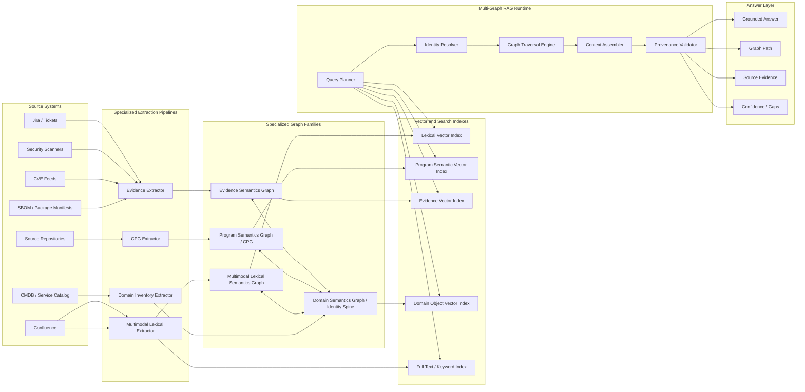


## 6. Specialized Extraction Pipelines

### 6.1 Confluence: Multimodal Lexical Semantics Graph

Confluence extraction should produce a lexical graph because the source is human-authored content.

#### Source Types

- Pages
- Sections
- Paragraphs
- Tables
- Images
- Architecture diagrams
- Sequence diagrams
- Attachments
- Comments
- Page hierarchy
- Page metadata

#### Output Objects

- `ConfluencePage`
- `Section`
- `TextChunk`
- `Statement`
- `Fact`
- `Topic`
- `TableChunk`
- `ImageArtifact`
- `DiagramArtifact`
- `AttachmentArtifact`
- `ExtractedEntity`
- `ExtractedRelationship`

#### Embedding Targets

Embed meaningful lexical units, not arbitrary fragments.

Good embedding targets:

- Page summary
- Section summary
- Text chunk
- Statement
- Table summary
- Diagram summary
- Image caption plus extracted text
- Attachment summary

Avoid embedding:

- Page title only
- Image filename only
- Raw HTML
- Raw table cells without context
- Duplicated boilerplate

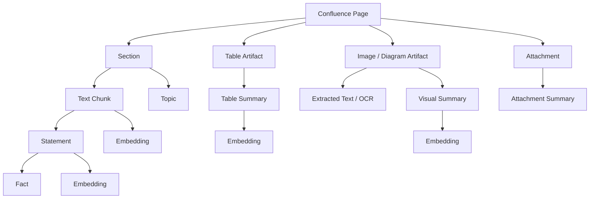


### 6.2 Source Code: Program Semantics Graph / CPG

Source-code extraction should produce a Program Semantics Graph, not a lexical graph.

The raw CPG preserves program structure and behavior. A semantic overlay turns raw graph structures into retrieval-grade objects.

#### Source Types

- Repositories
- Branches
- Commits
- Source files
- Package manifests
- Build files
- Code ownership metadata

#### Raw CPG Objects

- `File`
- `Namespace`
- `TypeDecl`
- `Method`
- `Parameter`
- `Call`
- `Identifier`
- `Literal`
- `ControlStructure`
- `Block`
- `Local`
- `Return`
- `AST_EDGE`
- `CALL_EDGE`
- `CFG_EDGE`
- `DDG_EDGE`
- `CDG_EDGE`

#### Semantic Overlay Objects

- `MethodSemanticUnit`
- `ClassSemanticUnit`
- `EndpointSemanticUnit`
- `CallChainSummary`
- `DataFlowSlice`
- `SourceSinkPath`
- `AuthGuardPattern`
- `SanitizerPattern`
- `TrustBoundaryCrossing`
- `VulnerabilityPatternCandidate`

#### Embedding Targets

Embed higher-level program-semantic units.

Good embedding targets:

- Method behavior summary
- Endpoint behavior summary
- Class/module summary
- Source-to-sink path summary
- Data-flow slice summary
- Call-chain summary
- Authorization pattern summary
- Vulnerability candidate rationale

Avoid embedding:

- Every AST node
- Every identifier
- Every literal
- Every raw edge
- Method name only
- Raw JSON dumps of CPG nodes

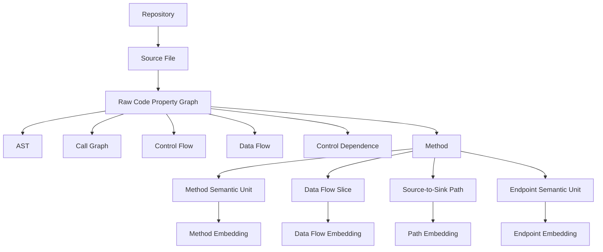


### 6.3 Evidence: Evidence Semantics Graph

Evidence extraction should normalize scanner and assessment data into evidence objects that can support findings, controls, risks, and verdicts.

#### Source Types

- SBOMs
- CVE feeds
- Dependency scans
- SAST findings
- DAST findings
- IaC findings
- Container findings
- Cloud configuration findings
- Tickets
- Exceptions
- Attestations
- Manual assessment notes

#### Output Objects

- `EvidenceObject`
- `Finding`
- `ScannerFinding`
- `SBOMComponent`
- `Package`
- `CVE`
- `Vulnerability`
- `Exception`
- `Ticket`
- `Attestation`
- `AssessmentResult`

#### Embedding Targets

- Finding summary
- Vulnerability summary
- Evidence bundle summary
- Exception rationale
- Ticket summary
- Assessment rationale

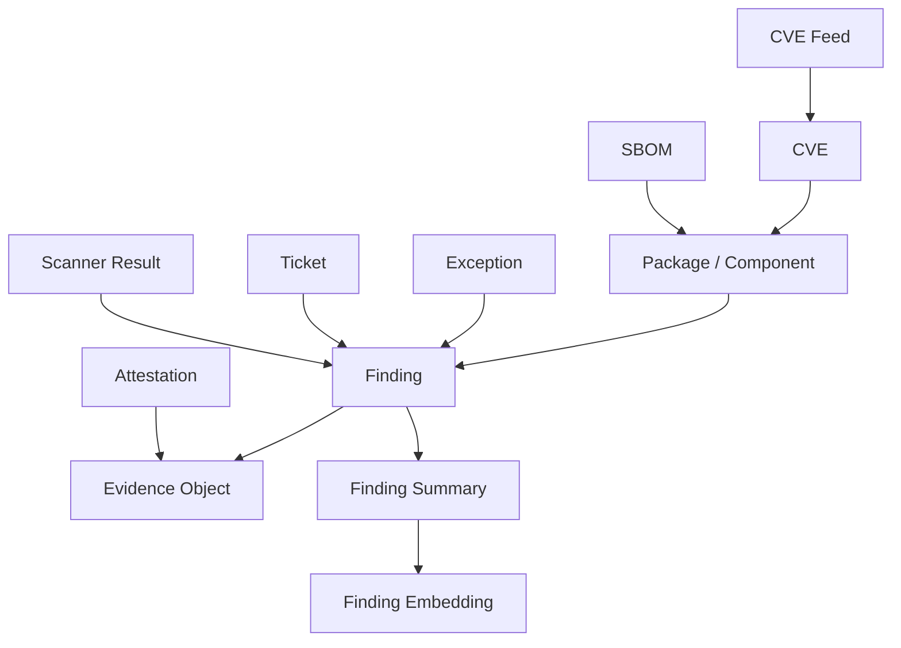

---

### 6.4 Domain: Canonical Identity Spine

The Domain Semantics Graph is the join layer. It should be populated from authoritative systems where possible.

#### Canonical Objects

- `Application`
- `Service`
- `Repository`
- `APIEndpoint`
- `Environment`
- `BusinessCapability`
- `Owner`
- `Team`
- `Control`
- `ControlIntent`
- `Risk`
- `RiskScenario`
- `Finding`
- `EvidenceObject`
- `DataClassification`
- `SystemBoundary`

#### Why This Layer Matters

The same system may appear under many names:

- `payment-service`
- `Payment Service`
- `payments-api`
- `github.com/org/payment-service`
- `PAY-APP-042`
- `prod-payment-api`

These must resolve to one canonical domain identity.

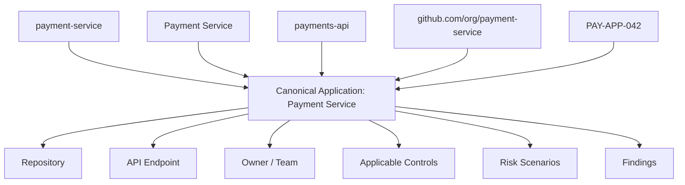


## 7. Cross-Graph Relationship Model

The system is joined through typed relationships.

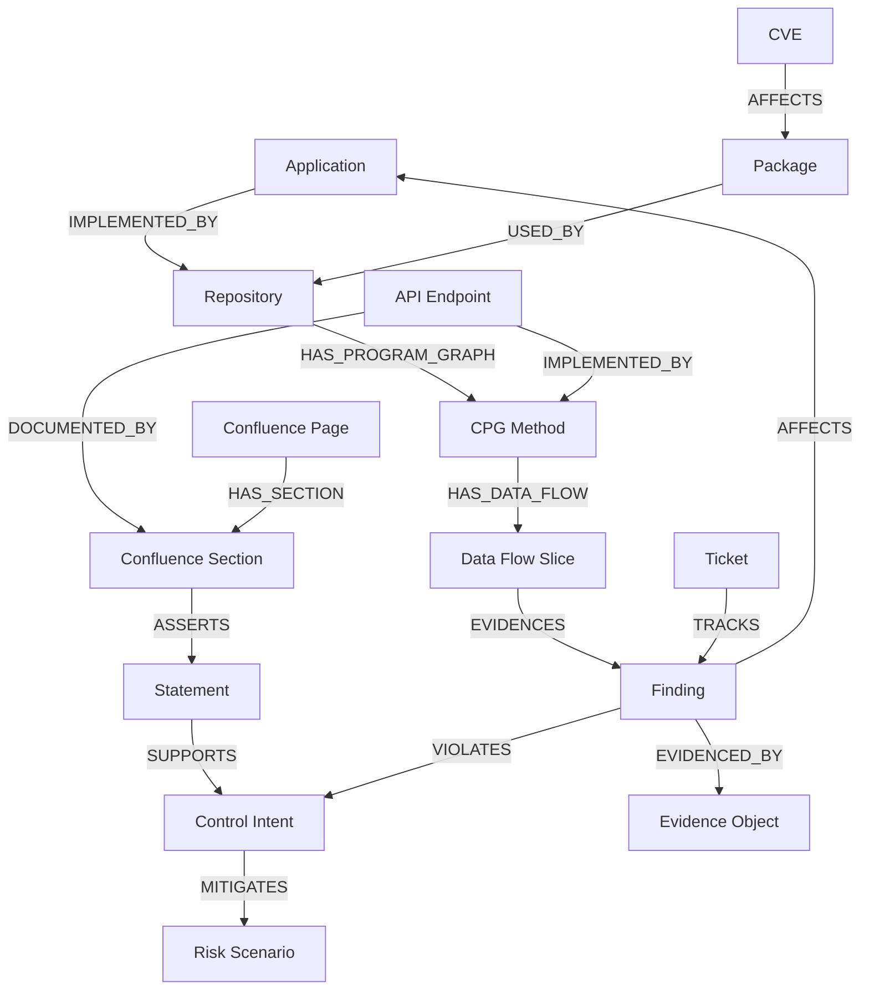


## 8. Retrieval Architecture

The retrieval system must act as a planner across multiple graph and vector indexes.

### 8.1 Retrieval Modes

| Query Type | Primary Graph | Secondary Graphs | Example |
|---|---|---|---|
| Documentation question | Lexical Graph | Domain Graph | “What does the runbook say about refunds?” |
| Code behavior question | Program Graph / CPG | Domain + Evidence | “Where is authorization checked?” |
| Security finding question | Evidence Graph | Program + Domain + Lexical | “What proves this finding?” |
| Application risk question | Domain Graph | Evidence + Program + Lexical | “Which applications have similar access risk?” |
| Multi-hop governance question | Domain Graph | All | “Does this app satisfy privileged access controls?” |

### 8.2 Runtime Flow

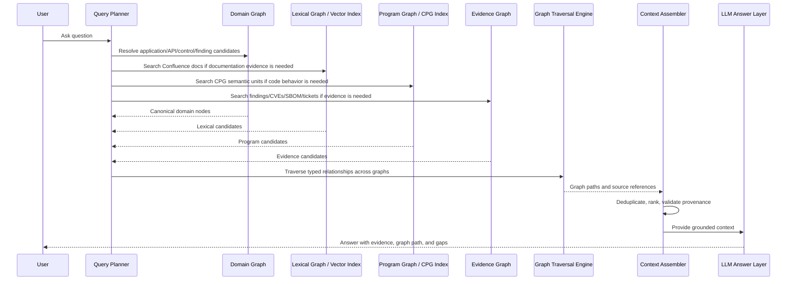


## 9. Example End-to-End Query

### Question

> Does the payment refund endpoint enforce authorization correctly?

### Expected Multi-Graph Plan

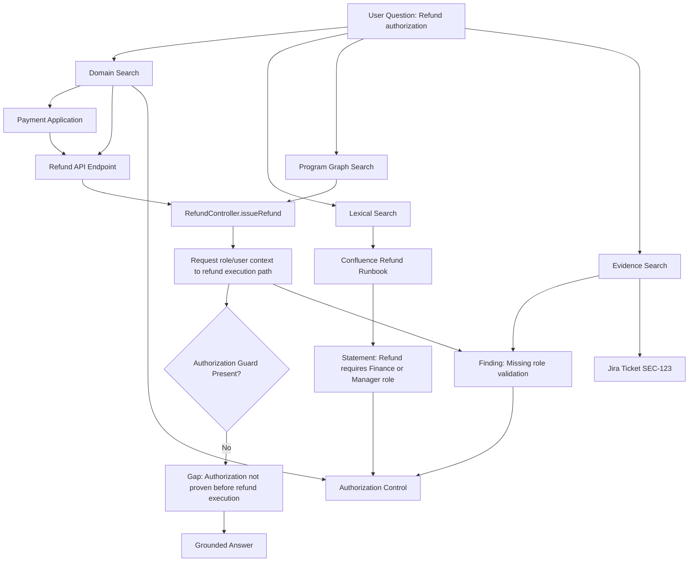

### Expected Answer Shape

The answer must include:

- Conclusion
- Code evidence
- Documentation evidence
- Finding/evidence references
- Graph path
- Confidence
- Gaps or missing evidence

Example:

```text
Conclusion: Authorization enforcement is not fully proven for the refund endpoint.

Evidence:
- Confluence states that refund actions require Finance or Manager role approval.
- The API endpoint maps to RefundController.issueRefund().
- The CPG path shows request data reaches the refund execution path.
- No authorization guard was observed before refund execution in the traversed control-flow path.
- Existing finding SEC-123 also references missing role validation.

Graph path:
Application → API Endpoint → CPG Method → Data Flow Slice → Finding → Control

Gap:
No confirmed guard/sanitizer node was found on the controlling path before refund execution.
```


## 10. Embedding Strategy

Embeddings should be used as semantic entry points, not as proof.

### 10.1 Embedding Targets by Graph

| Graph | Embed | Do Not Embed |
|---|---|---|
| Lexical Graph | Chunks, statements, section summaries, image summaries, table summaries | Raw HTML, filenames, duplicated boilerplate |
| Program Graph | Method summaries, endpoint summaries, data-flow slices, call-chain summaries, source-to-sink path summaries | Every AST node, every literal, every raw edge |
| Evidence Graph | Finding summaries, CVE summaries, ticket summaries, exception rationales | CVE ID alone, scanner ID alone |
| Domain Graph | Application summaries, API descriptions, control intent, risk scenarios | Random inventory IDs, names without context |

### 10.2 Embedding Text Contracts

Every embedded object must have a stable text surface.

#### Lexical Example

```text
Object: ConfluenceSection
Embedding text:
Title: Refund Authorization
Page: Payment Operations Runbook
Summary: Refund operations require Finance or Manager role approval before execution.
Extracted facts: Refunds above threshold require dual approval.
```

#### Program Example

```text
Object: MethodSemanticUnit
Embedding text:
Method: RefundController.issueRefund
Summary: Handles refund request and calls payment reversal logic.
Observed behavior: Request user context reaches refund execution path.
Authorization: No confirmed role guard observed before processRefund call.
Source: payment-service/src/refund/RefundController.java
```

#### Evidence Example

```text
Object: Finding
Embedding text:
Finding: Missing authorization guard on refund endpoint
Summary: Refund execution path can be reached without confirmed role validation.
Affected application: Payment Service
Related control: Privileged transaction authorization
Evidence: CPG data-flow path and scanner result SEC-123
```


## 11. Provenance and Evidence Requirements

Every answer must trace back to evidence.

### 11.1 Required Provenance Fields

| Evidence Type | Required Provenance |
|---|---|
| Confluence | page ID, page title, version, section, chunk ID, URL, timestamp |
| Image/Diagram | image URI, source page, extracted text, visual summary, model used, timestamp |
| Code | repo, commit SHA, branch, file path, method, line range, CPG node ID |
| CPG path | source node, sink node, path edges, guard/sanitizer evidence, traversal timestamp |
| SBOM | artifact ID, package name, version, supplier, generated timestamp |
| CVE | CVE ID, affected package/version, severity source, retrieval timestamp |
| Scanner finding | scanner, finding ID, rule ID, severity, target, evidence URI |
| Ticket | ticket ID, status, owner, linked finding, timestamps |

### 11.2 Provenance Flow

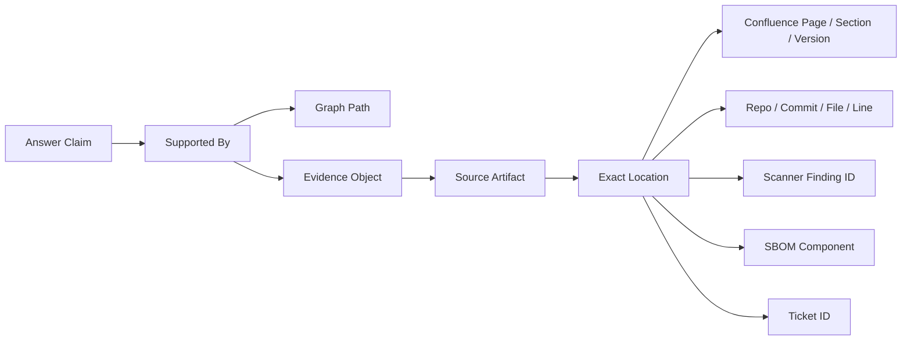

---

## 12. Storage and Indexing Responsibilities

This document is storage-neutral, but the recommended responsibility split is:

| Capability | Recommended Store Responsibility |
|---|---|
| Raw source artifacts | S3 or equivalent artifact store |
| Lexical graph relationships | Graph database |
| Program graph / CPG relationships | Graph database or CPG-native store |
| Domain identity spine | Graph database |
| Evidence relationships | Graph database |
| Vector similarity | Vector index or graph-native vector index |
| Full-text search | Search index |
| Operational state | Operational database |
| Provenance metadata | Artifact store + graph metadata |

The important design decision is not the product; it is the separation of responsibility:

```text
Artifact store = source truth
Graph store = relationship truth
Vector index = similarity entry point
Search index = keyword/discovery truth
Operational store = workflow/state truth
```


## 13. How AWS GraphRAG Toolkit Fits

The AWS GraphRAG Toolkit is useful, but it should not be treated as the only extraction model.

### 13.1 Suitable Uses

Use toolkit-style lexical GraphRAG for:

- Confluence pages
- PDFs
- Documents
- Architecture notes
- Runbooks
- Images and diagrams after text/visual summarization
- Statements, facts, topics, and entity extraction

Use BYOKG-style patterns for:

- Existing CPG graph
- Existing domain graph
- Existing evidence graph
- Multi-strategy graph retrieval over already-built knowledge graphs

### 13.2 Custom Layers Required

We still need custom layers for:

- CPG extraction and normalization
- Semantic Code Overlay generation
- CPG path summarization
- Source-to-sink path indexing
- Canonical identity resolution
- Cross-graph linking
- Query planning across graph families
- Provenance validation
- Multi-graph context assembly


## 14. Required Components

```mermaid
graph TD
    subgraph BuildTime[Build-Time Components]
        CONN[Source Connectors]
        EXTRACT[Extraction Workers]
        CANON[Canonical Identity Resolver]
        LINKER[Cross-Graph Linker]
        SUMM[Semantic Summarizers]
        EMBED[Embedding Workers]
        GRAPH_LOAD[Graph Loader]
        IDX_LOAD[Index Loader]
    end

    subgraph RunTime[Runtime Components]
        API[GraphRAG API]
        AUTH[AuthN/AuthZ]
        PLAN[Query Planner]
        SEARCH[Vector/Search Router]
        GRAPHQ[Graph Query Engine]
        CTX[Context Assembler]
        PROV[Provenance Validator]
        LLM[LLM Gateway]
        OBS[Observability]
    end

    CONN --> EXTRACT --> CANON --> LINKER --> SUMM --> EMBED
    LINKER --> GRAPH_LOAD
    EMBED --> IDX_LOAD

    API --> AUTH --> PLAN --> SEARCH
    PLAN --> GRAPHQ
    SEARCH --> CTX
    GRAPHQ --> CTX
    CTX --> PROV --> LLM
    API --> OBS
    PLAN --> OBS
    LLM --> OBS
```


## 15. Phase 1 Implementation Scope

### 15.1 Goal

Prove that a single user question can traverse:

1. Confluence documentation
2. Code Property Graph evidence
3. Domain identity spine
4. Evidence/finding records

and produce a grounded answer with provenance.

### 15.2 Minimum Phase 1 Data Set

- 1 application
- 1 repository
- 1 CPG export
- 5–10 Confluence pages
- 1 SBOM
- 5–10 scanner findings or synthetic findings
- 3–5 controls or control intents
- 1–2 representative questions

### 15.3 Phase 1 Acceptance Criteria

A successful Phase 1 must demonstrate:

- Confluence pages are chunked and vectorized as lexical artifacts.
- Images/diagrams receive text or visual summaries before embedding.
- CPG is loaded as a Program Semantics Graph.
- Higher-level CPG semantic units are created and embedded.
- Domain nodes canonicalize application, repository, API, control, and finding identity.
- Cross-graph links connect Confluence, CPG, evidence, and domain objects.
- Query planner chooses the correct graph/index based on question intent.
- Answer includes source references and graph path.
- Missing evidence is reported as a gap, not hallucinated.


## 16. Key Client Questions

### 16.1 Confluence / Lexical Graph

1. Which Confluence spaces are in scope for Phase 1?
2. Are page permissions required to be preserved during retrieval?
3. Do we need to ingest page comments?
4. Do we need version history, or only latest page versions?
5. Which attachment types are in scope: PDF, Word, Excel, images, draw.io, Lucid, PlantUML, Mermaid?
6. Are diagrams embedded as images, source files, or both?
7. Should image extraction include OCR, visual captioning, or both?
8. What metadata should be retained from Confluence: author, last updated, labels, space, page tree, permissions?

### 16.2 CPG / Program Graph

1. Which CPG extractor is being used?
2. What languages are in scope?
3. What graph schema is produced today?
4. Does the CPG include AST, CFG, DDG, CDG, and call graph?
5. Are line numbers and file paths preserved?
6. Is commit SHA captured at extraction time?
7. Are source-to-sink paths already calculated, or must we calculate them?
8. Are authorization guards, sanitizers, and trust boundaries already labeled?
9. What CPG node types are expected to be embedded today?
10. Are embeddings attached to raw nodes or semantic summaries?

### 16.3 Domain Identity

1. What is the authoritative application inventory?
2. How do we map repositories to applications?
3. How do we map API endpoints to services and methods?
4. How do we map Confluence pages to applications?
5. How do we map scanner findings to applications and repositories?
6. What alias sources exist?
7. Who owns canonical identity resolution?
8. Are teams and owners authoritative from CMDB, GitHub, LDAP, or another source?

### 16.4 Evidence

1. Which evidence types are required in Phase 1?
2. Are SBOMs available per repository, build, release, or application?
3. Which scanner outputs are available?
4. Are scanner findings normalized today?
5. Are CVE severities enriched with EPSS, KEV, exploitability, or business criticality?
6. Are exceptions and compensating controls available?
7. Do findings need a signed or immutable evidence trail?
8. Are tickets authoritative for remediation status?

### 16.5 Retrieval and Answering

1. What are the top 5 questions the system must answer first?
2. Should retrieval start with domain objects, Confluence text, CPG semantic units, or evidence findings?
3. Do answers require exact code lines?
4. Do answers require exact Confluence sections?
5. Should the system return graph paths?
6. Should the system return confidence scores?
7. What should happen when evidence is incomplete or conflicting?
8. Should answers be allowed without source evidence?

### 16.6 Security and Governance

1. Must Confluence permissions be enforced in retrieval?
2. Must source-code repository permissions be enforced in retrieval?
3. Are there tenant or business-unit boundaries?
4. Are embeddings allowed to contain sensitive code or documentation content?
5. Is there a data retention requirement for embeddings?
6. Are generated summaries considered derived sensitive data?
7. What audit logs are required for retrieval and answer generation?
8. Who can see graph paths and evidence details?


## 17. Recommended Naming

Use the following terms consistently with the client:

```text
Family:
  Semantics Graph

Instances:
  Multimodal Lexical Semantics Graph
  Program Semantics Graph
  Domain Semantics Graph
  Evidence Semantics Graph

Concrete implementation:
  Code Property Graph for program semantics

Combined architecture:
  Federated Semantics Graph
  or Semantic Evidence Fabric

Retrieval pattern:
  Multi-Graph RAG
  CPG-RAG for the code-specific retrieval path
```

Recommended client-facing sentence:

> We should treat Confluence as a Multimodal Lexical Semantics Graph and source code as a Program Semantics Graph implemented through the Code Property Graph. These should be joined through a Domain Semantics Graph, with SBOM, CVE, scanner findings, tickets, and attestations modeled as an Evidence Semantics Graph. The combined system is a Federated Semantics Graph using Multi-Graph RAG.


## 18. Architecture Decision Summary

| Decision | Recommendation |
|---|---|
| One graph or multiple graph families? | Multiple specialized graph families joined by domain identity. |
| Is Confluence lexical? | Yes. Model as Multimodal Lexical Semantics Graph. |
| Is CPG lexical? | No. Model as Program Semantics Graph. |
| Should CPG nodes be embedded? | Only higher-level semantic units, not every raw node. |
| What joins everything? | Domain Semantics Graph / canonical identity spine. |
| What provides proof? | Source artifacts, CPG paths, evidence objects, and provenance links. |
| What is the runtime pattern? | Multi-Graph RAG with query planning and graph traversal. |
| What custom layer is needed? | Semantic Federation Layer plus CPG Semantic Retrieval Adapter. |


## 19. Final Position

The correct architecture is not a single lexical graph and not a single vectorized CPG.

The correct architecture is a **Federated Semantics Graph**:

- **Confluence** becomes a **Multimodal Lexical Semantics Graph**.
- **Source code** becomes a **Program Semantics Graph** through the CPG.
- **SBOM, CVEs, findings, tickets, and attestations** become an **Evidence Semantics Graph**.
- **Applications, repositories, APIs, controls, risks, owners, and findings** become the **Domain Semantics Graph**.

The Domain Semantics Graph is the spine that connects the others. Embeddings provide semantic entry points. Graph traversal provides relationship proof. Source artifacts provide evidence. The answer layer must return conclusions with graph paths, source references, and explicit gaps.


## 20. References

- AWS GraphRAG Toolkit GitHub repository: https://github.com/awslabs/graphrag-toolkit
- AWS Database Blog: Introducing the GraphRAG Toolkit: https://aws.amazon.com/blogs/database/introducing-the-graphrag-toolkit/
- GraphRAG.com Lexical Graph reference: https://graphrag.com/reference/knowledge-graph/lexical-graph/
- AWS BYOKG-RAG announcement: https://aws.amazon.com/about-aws/whats-new/2025/08/amazon-neptune-supports-byokg-rag-toolkit/

