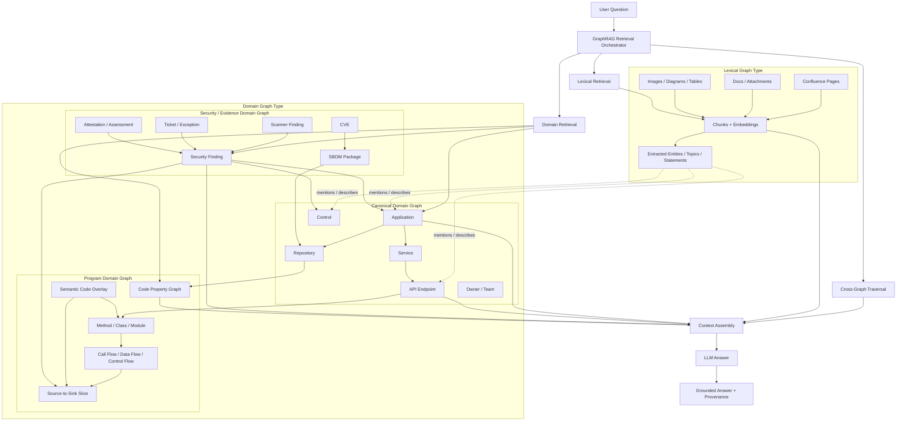
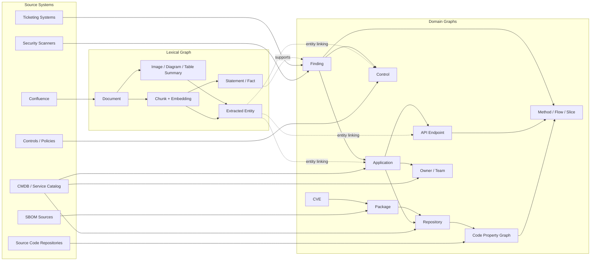
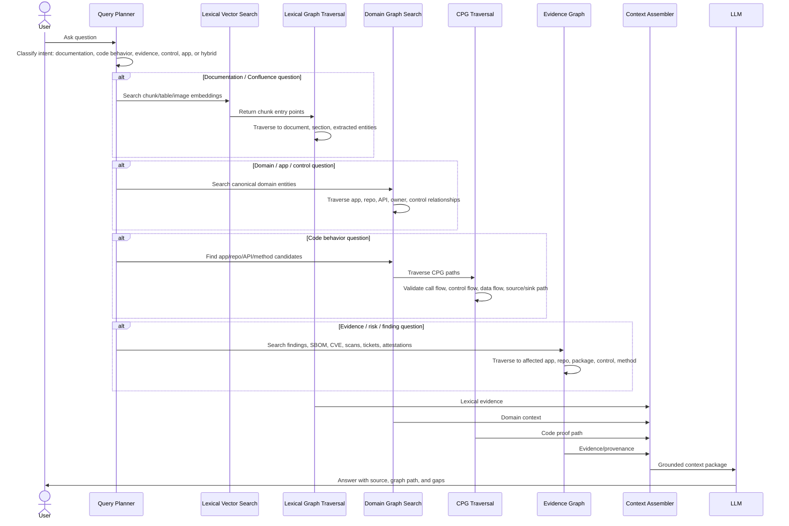
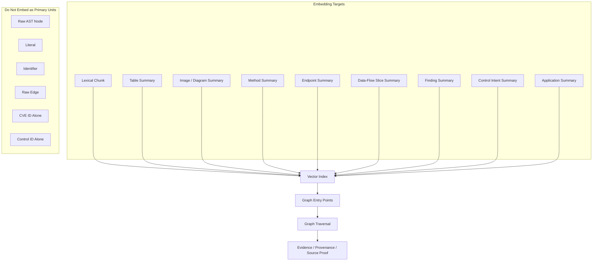
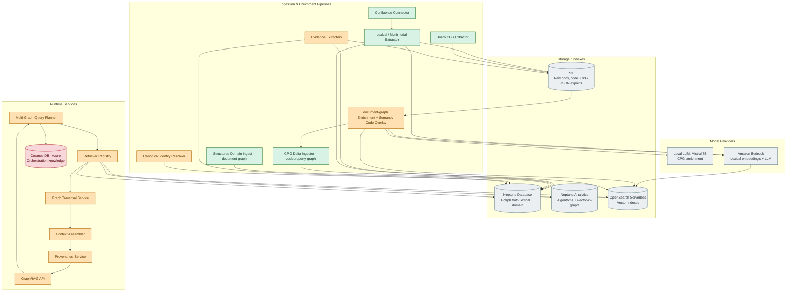

# GraphRAG.com-Aligned Architecture: Lexical Graph + Domain Graph

## 1. Purpose

This document redraws the proposed architecture using the terminology and graph-shape model from GraphRAG.com.

The key correction is that we should not introduce competing top-level graph families. For client and developer alignment, we should use the GraphRAG.com graph-shape vocabulary:

- **Lexical Graph**: graph built from documents, chunks, embeddings, and optionally extracted entities.
- **Domain Graph**: graph built from structured domain entities and relationships.

Under this model:

- Confluence is modeled as a **Lexical Graph**.
- The Code Property Graph is modeled as a **Domain Graph instance for the program/code domain**.
- SBOM, CVE, scan findings, tickets, attestations, controls, applications, repositories, and APIs are modeled as **Domain Graph instances**.
- The combined system is a **Multi-Graph GraphRAG architecture** that retrieves across lexical and domain graphs.

### Scope and status

This document describes the **target reference architecture** — the end-state graph shapes and retrieval model. It is intentionally forward-looking in places. Two sections keep it grounded in what actually exists:

- **Section 13 — Concrete Technology Binding** maps every abstract element to the real stack (`lexical-graph`, `document-graph`, `codeproperty-graph`, Neptune Database, OpenSearch Serverless, S3, Bedrock).
- **Section 14 — Implementation Status: Have vs Build** states what is implemented today versus what remains — principally the CPG-RAG overlay and the multi-graph federation layer.

Companion documents: `neptune_vs_neptune_analytics_cpg_rag_architecture.md` (storage split) and `graphrag_phased_architecture.md` (Phase 1 / Phase 2 scope).

---

## 2. GraphRAG.com Grounding

GraphRAG.com defines GraphRAG as a set of RAG patterns that leverage graph structure for retrieval. Different patterns require different graph shapes.

For this architecture, the important graph shapes are:

| GraphRAG.com graph type | Meaning | Client-specific use |
|---|---|---|
| **Lexical Graph** | Document/chunk-centered graph with embeddings and source lineage. | Confluence, documentation, diagrams, tables, images, attachments. |
| **Domain Graph** | Structured graph of real-world/domain entities and relationships. | Applications, APIs, repos, controls, CPG, SBOM, CVE, scans, findings, tickets, evidence. |

The architecture therefore combines one or more Lexical Graphs with one or more Domain Graphs.

---

## 3. Corrected Terminology

| Term | GraphRAG.com alignment | Definition |
|---|---|---|
| Lexical Graph | Graph shape | A document/chunk graph used for human-authored content. Chunks hold human-readable text and embeddings. |
| Multimodal Lexical Graph | Lexical Graph instance | A Lexical Graph extended for Confluence pages, diagrams, images, tables, screenshots, and attachments. |
| Domain Graph | Graph shape | A structured graph of real-world or domain-specific entities and relationships. |
| Program Domain Graph | Domain Graph instance | A Domain Graph representing program/code behavior. The Code Property Graph is the concrete implementation. |
| Code Property Graph | Domain Graph implementation | Structured graph of code syntax, call flow, control flow, and data flow. |
| Semantic Code Overlay | Domain Graph overlay | Higher-level code behavior summaries, method summaries, endpoint summaries, call-chain summaries, and source-to-sink summaries attached above raw CPG nodes. |
| Security/Evidence Domain Graph | Domain Graph instance | Structured graph for SBOM, CVEs, scans, tickets, findings, exceptions, attestations, and assessment results. |
| Canonical Domain Graph | Domain Graph instance | Identity spine for applications, services, repositories, APIs, controls, owners, environments, and teams. |
| Multi-Graph GraphRAG | Retrieval architecture | Retrieval pattern that searches and traverses across Lexical Graphs and Domain Graphs to assemble grounded context. |

---

## 4. Architecture at a Glance



---

## 5. Source-to-Graph Mapping



> Correctness note: the dashed `entity linking` / `supports` edges are the **target** cross-graph links. Today that linking is derived from lexical **entity extraction** (fuzzy), not from a canonical identity spine — `lexical-graph` does not preserve custom node metadata through indexing, so a chunk cannot yet carry a stable `graph_node_id` back to a canonical domain node. Until the identity/overlay layer exists (Section 14), treat these as candidate links, not proof.

---

## 6. Retrieval Flow

This architecture uses multiple GraphRAG retrieval patterns. The query planner decides which retriever to use first and how to expand context.



---

## 7. Retrieval Pattern Mapping

| Question type | Initial graph shape | Retrieval pattern | Expansion path |
|---|---|---|---|
| “What does Confluence say about X?” | Lexical Graph | Basic Retriever / Graph-Enhanced Vector Search | Chunk → document → extracted entity → domain object |
| “Which app owns this API?” | Domain Graph | Pattern Matching / structured domain query | API → service → application → owner |
| “Where is this endpoint implemented?” | Domain Graph | Domain query + CPG traversal | API → repo → CPG method → source location |
| “Does this endpoint enforce authorization?” | Domain Graph | CPG traversal + evidence retrieval | API → method → control flow/data flow → guard/sink → finding |
| “Which CVEs affect this app?” | Domain Graph | Structured evidence traversal | App → repo → package → CVE → finding |
| “What evidence supports this finding?” | Domain Graph + Lexical Graph | Multi-graph retrieval | Finding → CPG slice / scan / ticket / Confluence statement |
| “What changed from documentation to code?” | Lexical + Domain Graphs | Cross-graph comparison | Confluence statement → API/control → CPG implementation path |

---

## 8. Embedding Strategy

Embeddings should be used as entry points, not as proof.



---

## 9. Developer Implementation View

Status legend: green = implemented today, amber = to build, gray = managed infrastructure, red = cross-cloud (to reconcile). Full breakdown in Section 14; the current-vs-recommended ingestion flow is in Section 15.



> Enrichment happens **before** Neptune, not inside it. Joern writes CPG JSON to S3; `document-graph` enriches that JSON — calling the **local Mistral 7B** model through a pluggable model-provider interface — and only the finished, enriched graph is bulk-loaded into Neptune by `codeproperty-graph`. `codeproperty-graph` never mutates the graph for enrichment, and code-summary embeddings are written to OpenSearch, not Neptune. This retires the client's Neo4j enrichment step (Section 15).

---

## 10. Critical Design Rule

Do not collapse every artifact into one generic graph.

The corrected rule is:

```text
Confluence = Lexical Graph
Code Property Graph = Domain Graph instance for the program/code domain
SBOM/CVE/findings/tickets = Domain Graph instances for security/evidence
Applications/repos/APIs/controls/owners = Canonical Domain Graph identity spine
Combined retrieval = Multi-Graph GraphRAG
```

---

## 11. Client Questions to Confirm

### Lexical Graph / Confluence

1. Which Confluence spaces are in scope for Phase 1?
2. Should we ingest pages only, or also comments, attachments, embedded diagrams, PDFs, and images?
3. Do diagrams need visual interpretation, OCR, or both?
4. What metadata must be preserved: author, modified date, page version, space, labels, permissions?
5. Should Confluence permissions be enforced at retrieval time?

### Domain Graph / Program CPG

1. Which CPG extractor is being used?
2. What languages and repository types are in scope?
3. Are AST, call graph, control flow, and data flow all available?
4. What is the stable identifier for repo, commit, file, method, and graph node?
5. Which higher-level semantic code units should be generated: method summaries, endpoint summaries, data-flow slices, source-to-sink paths, or vulnerability patterns?

### Domain Graph / Security Evidence

1. Which evidence sources are in scope: SBOM, CVE, scans, tickets, exceptions, attestations, assessments?
2. What is the canonical finding model?
3. How do findings link to applications, repositories, methods, packages, controls, and tickets?
4. What evidence is considered authoritative versus advisory?
5. How is evidence versioned and invalidated?

### Cross-Graph Identity

1. What is the canonical application identifier?
2. How do Confluence app names map to CMDB/service catalog app names?
3. How do repositories map to applications and services?
4. How do API endpoints map to CPG methods?
5. How are aliases, renamed services, archived apps, and duplicate entities handled?

### Retrieval and Answering

1. Should retrieval start with lexical chunks, domain entities, or both?
2. Which questions require deterministic graph traversal instead of vector similarity?
3. What provenance must be returned with every answer?
4. Should confidence scoring include vector score, graph path strength, evidence freshness, and authority?
5. What should the system do when Confluence documentation disagrees with code behavior?

---

## 12. Recommended Phase 1 Scope

Phase 1 should prove the architecture with a narrow vertical slice:

```text
One application
One repository
One CPG extraction
One Confluence space
One SBOM source
One scanner/finding source
One control family, for example authentication/authorization
```

The success criteria should be the ability to answer questions such as:

1. Which Confluence pages describe this application or API?
2. Where is this API implemented in code?
3. What code path handles the request?
4. Is the expected control described in documentation?
5. Is the control visible in the CPG traversal?
6. Are there findings, CVEs, packages, or tickets related to this implementation?
7. What evidence supports the final answer?


---

## 13. Concrete Technology Binding

The abstract graph shapes bind to a specific toolkit + AWS stack. This mirrors the storage split defined in `neptune_vs_neptune_analytics_cpg_rag_architecture.md`.

| Architecture element | Concrete implementation |
|---|---|
| Lexical Graph engine | graphrag-toolkit `lexical-graph` (`LexicalGraphIndex`, `LexicalGraphQueryEngine`) |
| Structured Domain Graph | `document-graph` (schema-driven ingest, transformers, normalizers, multi-tenancy) |
| Program Domain Graph (CPG) | `codeproperty-graph` (delta ingest → Neptune; `delta_ingestor`, `graph_diff`, `manifest_manager`, `models`, `schema`, `tenant_ops`) |
| CPG extractor | Joern — emits CPG as JSON artifacts to S3 |
| CPG enrichment model | **Local LLM — Mistral 7B** (self-hosted inference endpoint), interfaced by `document-graph` through a pluggable model provider |
| Graph store (lexical + domain truth) | Amazon Neptune Database — single cluster, logical separation by tenant/label encoding (`__Type__tenant_id__`) |
| Vector store | Amazon OpenSearch Serverless (AOSS) |
| Object / artifact store | Amazon S3 (raw docs, code snapshots, CPG JSON exports, images) |
| Lexical embeddings + generation | Amazon Bedrock |
| Analytics engine | Amazon Neptune Analytics — graph algorithms and vector-in-graph analytics (target) |
| Orchestration knowledge store | Azure Cosmos DB (current) — cross-cloud; AWS-native reconciliation is an open decision |
| Retired | Neo4j — client currently enriches CPG in Neo4j; retired in favor of JSON-stage enrichment + Neptune |

Key bindings:

- The GraphRAG.com `GraphStore` and `VectorStore` are **separate instances**: Neptune Database is the durable graph truth; OpenSearch Serverless is the vector surface. Bulk embeddings do not live in Neptune.
- Lexical Graph and Domain Graphs are distinct graph *shapes* but can share **one** Neptune cluster, separated logically by tenant/label rather than by separate databases.
- **Enrichment happens before Neptune, not inside a graph database.** Joern emits CPG JSON to S3; `document-graph` enriches that JSON by calling the local **Mistral 7B** model, and only the finished graph is bulk-loaded into Neptune. This retires Neo4j-based enrichment and avoids read-modify-write churn against a live graph — the time and cost saving (Section 15).
- **Model providers are pluggable.** CPG enrichment uses a self-hosted **Mistral 7B**; lexical embeddings/LLM currently use **Bedrock**. Whether the lexical models also move to local inference is an open item.
- **Neptune Analytics** is part of the target for graph algorithms and vector-in-graph analytics; it does not replace Neptune Database as the durable truth or OpenSearch as the primary vector surface (companion storage doc).
- **Cosmos DB (Azure)** is the one cross-cloud dependency in an otherwise AWS stack — Azure↔AWS egress, added latency, split identity boundary. Reconciling it to an AWS-native store (e.g. DynamoDB) is an open decision (Section 14).
- Embeddings are entry points; Neptune traversal is proof — consistent with Section 8.
- Neptune version must be ≥ 1.4.x for the nested-`UNWIND` support the lexical-graph toolkit relies on; `any()` predicates are unsupported, and batched writes should be validated before enabling.

---

## 14. Implementation Status: Have vs Build

| Capability | Graph shape | Provided by (today) | Status |
|---|---|---|---|
| Lexical ingest, chunking, embeddings, single-graph retrieval | Lexical Graph | `lexical-graph` | Have |
| Structured domain graph, schema-driven ingest, multi-tenancy | Domain Graph | `document-graph` | Have |
| Raw CPG ingest (delta, diff, manifests, tenant ops) | Program Domain Graph | `codeproperty-graph` | Have |
| Durable graph store | — | Amazon Neptune Database | Have (deployed) |
| Vector store | — | Amazon OpenSearch Serverless | Have (deployed) |
| Object / artifact store | — | Amazon S3 | Have |
| CPG extraction to JSON | Program Domain Graph | Joern | Have |
| Lexical embeddings + LLM | — | Amazon Bedrock | Have |
| Analytics engine | — | Amazon Neptune Analytics | Target (not yet deployed) |
| `document-graph` ↔ local LLM (Mistral 7B) enrichment interface | Program Domain overlay | pluggable model provider | Build |
| Multimodal extraction (diagrams / tables / images, OCR) | Lexical Graph | `lexical-graph` extension | Partial |
| Semantic Code Overlay (method / endpoint / source-to-sink summaries + embeddings), enriched on JSON pre-load via Mistral 7B | Program Domain overlay | — | Build |
| Canonical identity spine + resolver (app / service / repo / API / control / owner) | Canonical Domain Graph | minimal identity in `codeproperty-graph` models; no resolver | Build |
| Cross-graph linking (lexical entity ↔ canonical ↔ CPG semantic) | Multi-graph | entity-extraction correlation only (fuzzy) | Build |
| Multi-graph query planner / federated retrieval + provenance | Multi-Graph GraphRAG | `lexical-graph` query engine is single-graph | Build |
| Security / Evidence domain graph (SBOM / CVE / scan / ticket / attestation) | Evidence Domain Graph | — | Build (Phase 2) |
| CPG enrichment in Neo4j | Program Domain Graph | client current-state | Retire → Neptune |
| Orchestration knowledge store | — | Azure Cosmos DB | Have (cross-cloud) — AWS reconciliation open |

### The missing layer

The three base capabilities exist as independent parts: lexical retrieval (`lexical-graph`), a structured domain graph (`document-graph`), and raw CPG ingest (`codeproperty-graph`). What does not yet exist is the layer that turns three independent graphs into one CPG-RAG system:

1. **Semantic Code Overlay builder** — raw CPG → method / endpoint / source-to-sink summaries as `SemanticCodeUnit` nodes, embedded (never raw AST nodes or edges).
2. **Canonical identity spine + resolver** — application / service / repository / API / control / owner identity that both lexical and code entities resolve to.
3. **Cross-graph linker** — replaces today's entity-extraction correlation with explicit canonical-identity edges written at ingest.
4. **Multi-graph query planner** — vector entry across both indexes, then federated traversal (lexical → canonical → CPG proof path) with provenance assembly.

Items 1–4 are the amber nodes in Section 9. They sit above `lexical-graph`, `document-graph`, and `codeproperty-graph`; everything below them (lexical retrieval, CPG ingest, and the Neptune / OpenSearch / S3 / Bedrock stack) already exists or is decided.
