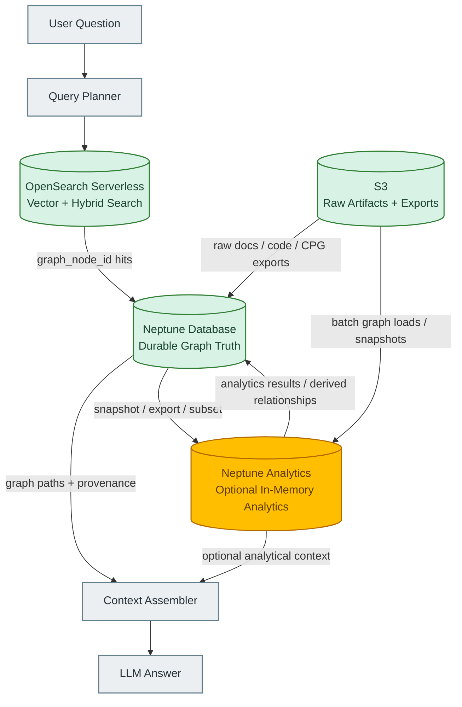
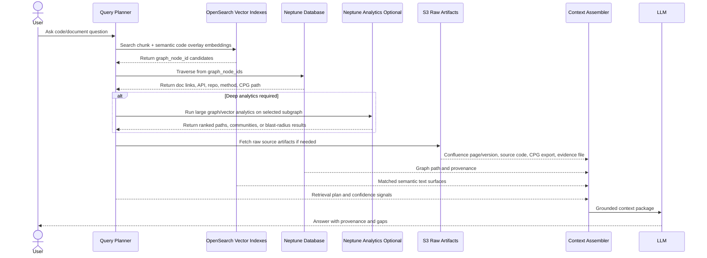

# CPG-RAG Storage Architecture: Neptune Database, OpenSearch, and Neptune Analytics

## 1. Purpose

This document explains how embeddings should be overlaid on the document graph and CPG graph in a CPG-RAG architecture, and why the storage architecture should usually be **split by requirement** rather than putting everything into either **Neptune Database** or **Neptune Analytics**.

The main architectural point is:

> **Neptune Database should usually be the durable graph truth. OpenSearch should usually be the scalable vector-search surface. Neptune Analytics should be used selectively for high-speed analytical graph/vector workloads, not as the default home for every graph and vector.**

This is especially important because **Neptune Analytics is memory-optimized** and priced around memory-optimized capacity. It is powerful, but it should be introduced where the workload actually needs in-memory graph analytics, native vector search inside graph traversal, or large-scale graph algorithms.

---

## 2. Context: What We Are Building

The client architecture has two Phase 1 graph areas:

1. **Confluence Lexical Graph**
   - Human-authored content.
   - Pages, sections, chunks, diagrams, images, tables, and extracted entities/statements.
   - Embeddings are created for chunks, section summaries, table summaries, image/diagram summaries, and possibly statements.

2. **CPG / Program Domain Graph**
   - Source-code graph.
   - Code Property Graph with AST, call graph, control flow, and data flow.
   - A **Semantic Code Overlay** is created above the raw CPG.
   - Embeddings are created for higher-level code semantics, not raw AST nodes.

The important design principle:

```text
Embedding = semantic entry point
Graph      = relationship truth and proof path
Source     = evidence truth
```

For example, an embedding may help us find a method summary that appears related to authorization, but the CPG traversal must prove whether an authorization guard exists on the relevant execution path.

---

## 3. What an Embedding Looks Like

An embedding record is not the graph itself. It is a semantic index record that points back to a graph node.

### 3.1 Document graph embedding example

```json
{
  "id": "chunk::confluence::PAY::page-123::v17::chunk-004",
  "graph_node_id": "chunk::confluence::PAY::page-123::v17::chunk-004",
  "index_type": "lexical_chunk",
  "source_type": "confluence",
  "text": "The Refund API requires Finance role approval before issuing refunds.",
  "embedding": [0.013, -0.042, 0.118, "..."],
  "metadata": {
    "tenant_id": "client-a",
    "space_key": "PAY",
    "page_id": "123",
    "page_version": 17,
    "section": "Refund authorization",
    "source_uri": "https://confluence/..."
  }
}
```

The matching graph node in Neptune might be:

```cypher
(:Chunk {
  id: "chunk::confluence::PAY::page-123::v17::chunk-004",
  sourceType: "confluence",
  pageId: "123",
  pageVersion: 17,
  sourceUri: "https://confluence/..."
})
```

OpenSearch answers:

```text
Which chunks are semantically similar to this question?
```

Neptune answers:

```text
What is this chunk connected to?
```

Example graph traversal:

```cypher
(:Chunk)-[:PART_OF]->(:Section)-[:PART_OF]->(:ConfluencePage)
(:Chunk)-[:MENTIONS]->(:APIEndpoint)
(:Chunk)-[:SUPPORTS]->(:Statement)
(:APIEndpoint)-[:IMPLEMENTED_BY]->(:Method)
```

### 3.2 CPG semantic overlay embedding example

Do **not** embed raw low-level CPG nodes as the primary embedding unit:

```json
{
  "id": "cpg::node::123456",
  "label": "CALL",
  "name": "assignRole",
  "embedding": ["..."]
}
```

That is too small and too context-poor.

Instead, embed a higher-level semantic code unit:

```json
{
  "id": "code-semantic::payment-api::a1b2::RefundController.issueRefund",
  "graph_node_id": "semantic-code-unit::RefundController.issueRefund",
  "index_type": "code_method_summary",
  "source_type": "cpg",
  "text": "HTTP endpoint handler for issuing refunds. Accepts refund request input, loads payment transaction, checks transaction status, and calls PaymentGateway.refund. No authorization guard is observed before the refund operation.",
  "embedding": [0.021, -0.018, 0.064, "..."],
  "metadata": {
    "tenant_id": "client-a",
    "application_id": "payment-service",
    "repository": "payment-api",
    "commit": "a1b2c3d4",
    "file": "src/main/java/com/acme/RefundController.java",
    "method": "RefundController.issueRefund",
    "language": "java",
    "semantic_unit_type": "method_summary",
    "cpg_node_id": "cpg::method::98765"
  }
}
```

The matching graph structure in Neptune:

```cypher
(:SemanticCodeUnit {
  id: "semantic-code-unit::RefundController.issueRefund",
  type: "method_summary",
  repository: "payment-api",
  commit: "a1b2c3d4"
})
-[:SUMMARIZES]->
(:Method {
  cpgNodeId: "cpg::method::98765",
  name: "RefundController.issueRefund",
  file: "src/main/java/com/acme/RefundController.java"
})
```

The CPG then preserves proof relationships:

```cypher
(:Method)-[:CALLS]->(:Method)
(:Method)-[:HAS_CONTROL_FLOW]->(:ControlFlowPath)
(:Method)-[:HAS_DATA_FLOW]->(:DataFlowPath)
(:DataFlowPath)-[:REACHES]->(:Sink)
```

---

## 4. AWS Service Roles

## 4.1 Neptune Database

**Primary role:** durable operational graph store.

Use Neptune Database for:

- Durable graph truth.
- Canonical graph relationships.
- Application, repository, API, method, chunk, statement, and evidence relationships.
- Repeated operational query workloads.
- Multi-AZ durability and managed graph database operation.
- Production graph state that must be stable and auditable.

AWS describes Neptune Database as a managed graph database with read replicas, point-in-time recovery, continuous backup to S3, and replication across Availability Zones.[^aws-neptune-db]

### Good fit

```text
Application → Repository → CPG → Method → DataFlowPath
ConfluenceChunk → Mentions → APIEndpoint
Finding → EvidencedBy → CPGPath
Package → UsedBy → Repository
```

### Weak fit

Neptune Database is not where we should put large-scale vector search if OpenSearch or S3 Vectors is the better vector store. It is also not the best engine for fast in-memory whole-graph analytics such as PageRank-style algorithms, large community detection, or high-speed exploratory graph algorithms.

---

## 4.2 OpenSearch Serverless

**Primary role:** scalable vector search and text/hybrid retrieval surface.

Use OpenSearch for:

- Document chunk embeddings.
- Statement embeddings.
- Diagram/table/image summary embeddings.
- Semantic code overlay embeddings.
- Finding or evidence-summary embeddings in Phase 2.
- Metadata-filtered vector search.
- Hybrid keyword + vector search where needed.

In the GraphRAG Toolkit storage model, the lexical graph uses separate `GraphStore` and `VectorStore` instances. The docs describe the graph store as Neptune/Neptune Analytics-compatible and the vector store as OpenSearch Serverless, Neptune Analytics, Postgres/pgvector, or S3 Vectors-compatible.[^toolkit-storage]

### Good fit

```text
Question embedding
  → OpenSearch vector search
  → top-k chunk / statement / code-summary hits
  → graph_node_id pointers
  → Neptune graph traversal
```

### Weak fit

OpenSearch is not the graph truth. It should not be used to answer relationship questions by itself. It can return candidate IDs, but Neptune should assemble the graph path and provenance.

---

## 4.3 Neptune Analytics

**Primary role:** in-memory graph analytics and optional unified graph + vector analysis.

Use Neptune Analytics for:

- High-speed analytical graph queries.
- Investigatory/exploratory graph workloads.
- Large in-memory graph processing.
- Built-in graph algorithms.
- Native vector search inside graph traversal.
- Temporary or dedicated analytical graphs loaded from Neptune Database or S3.

AWS describes Neptune Analytics as a **memory-optimized graph database engine for analytics** that stores large graph datasets in memory and supports graph algorithms, low-latency graph queries, and vector search within graph traversals.[^na-what-is]

AWS also explicitly positions Neptune Analytics as complementary to Neptune Database, and notes that data can be loaded from a Neptune Database graph, a Neptune snapshot, or S3.[^na-what-is]

### Good fit

```text
Run large graph algorithms:
  PageRank, centrality, community detection, path analysis

Run high-speed investigative analysis:
  Similar methods across thousands of repos
  Similar source-to-sink paths across all applications
  SBOM vulnerability blast-radius analysis
  Large-scale graph-vector exploration
```

### Weak fit

Neptune Analytics should not automatically become the primary home for everything. It is memory-optimized and capacity-driven. It can be expensive if used as an always-on production graph for workloads that do not need in-memory analytics.

Also, Neptune Analytics has some vector-index constraints. AWS documentation states that a Neptune Analytics graph can have only one vector index, created at graph creation time, with a fixed dimension.[^na-vector-index]

This matters if we want different embedding dimensions, multiple embedding models, or many separate vector indexes for document chunks, statements, code summaries, findings, and evidence bundles.

---

## 5. Why Not Put Everything in Neptune Analytics?

Do **not** put everything in Neptune Analytics by default because the workload requirements are different.

| Requirement | Best default | Reason |
|---|---|---|
| Durable graph truth | Neptune Database | Managed durable graph store with backups, HA, and operational graph query support. |
| High-volume vector search over chunks and summaries | OpenSearch Serverless | Mature vector/text retrieval surface with metadata filtering and scalable index separation. |
| Large-scale graph algorithms | Neptune Analytics | In-memory analytics engine designed for fast graph algorithms and exploratory graph analysis. |
| Native vector + graph traversal in one engine | Neptune Analytics | Useful when the graph/vector loop must run inside one in-memory graph engine. |
| Cheap cold artifact storage | S3 | Raw documents, code snapshots, CPG exports, and batch artifacts should live in S3. |
| Phase 1 operational GraphRAG | Neptune Database + OpenSearch | Strong split between graph truth and vector search. |
| Periodic deep analysis | Neptune Analytics on demand | Load/export subset or snapshot only when needed. |

Neptune Analytics can reduce operational complexity when graph and vector search need to be unified inside one engine, but that does not mean it is the right default for all data. AWS notes that vector similarity in Neptune Analytics can reduce overhead because you do not manage separate stores or sync pipelines.[^na-vector-similarity] That benefit must be weighed against cost, vector-index constraints, and workload fit.

---

## 6. Why Not Put Everything in Neptune Database?

Do **not** put everything in Neptune Database either.

Neptune Database should be the durable graph truth, but it should not become:

- a massive vector store for all embeddings,
- a document search engine,
- a high-volume lexical retrieval engine,
- or an in-memory analytics engine.

The GraphRAG Toolkit’s own storage model separates `GraphStore` from `VectorStore`, which reflects the same architecture principle.[^toolkit-storage]

In a CPG-RAG system, Neptune Database should hold relationships such as:

```text
Chunk → Mentions → APIEndpoint
APIEndpoint → ImplementedBy → Method
Method → HasDataFlow → SourceSinkPath
Finding → EvidencedBy → SourceSinkPath
Application → Owns → Repository
Repository → Contains → Package
```

OpenSearch should hold semantic indexes such as:

```text
chunk embeddings
statement embeddings
diagram summary embeddings
method summary embeddings
endpoint summary embeddings
data-flow slice embeddings
finding summary embeddings
```

Neptune Analytics should be introduced when a workload requires in-memory graph-vector analytics or large graph algorithms.

---

## 7. Recommended Split Architecture



### Recommended default for Phase 1

```text
Neptune Database  = durable graph truth
OpenSearch        = vector search over lexical chunks and semantic code overlay
S3                = raw artifacts, CPG exports, document snapshots
Neptune Analytics = optional, not default
```

### Recommended default for Phase 2

```text
Neptune Database  = durable cross-artifact graph truth
OpenSearch        = vector search over documents, code summaries, findings, evidence summaries
S3                = raw evidence and historical exports
Neptune Analytics = on-demand or dedicated analytics for large subgraph analysis
```

---

## 8. When to Use Neptune Analytics

Use Neptune Analytics when at least one of these is true:

1. We need graph algorithms across large subgraphs.
2. We need fast investigative traversal over many applications, repositories, packages, and findings.
3. We need native vector search and graph traversal in one in-memory engine.
4. We need to analyze a snapshot or exported subgraph from S3 or Neptune Database.
5. The workload is exploratory, data-science-heavy, or periodic rather than always-on operational traffic.

Example workloads:

```text
Find applications most central to vulnerability blast radius.
Find communities of repositories sharing risky dependency patterns.
Find similar source-to-sink paths across all repositories.
Rank controls by graph centrality across findings and assets.
Run SBOM vulnerability graph algorithms across large dependency graphs.
```

AWS documentation describes Neptune Analytics as suitable for investigatory, exploratory, and data-science workloads requiring fast iteration, algorithmic processing, or vector search on graph data.[^na-what-is]

---

## 9. When to Avoid Neptune Analytics

Avoid Neptune Analytics as the default when:

1. We only need durable relationship storage.
2. The workload is routine operational GraphRAG.
3. OpenSearch can perform vector search and Neptune Database can perform the required graph traversal.
4. We need multiple independent vector indexes with different dimensions or embedding models.
5. The graph is large, always-on, and cost-sensitive, but does not require in-memory analytics.
6. The data changes frequently and vector update consistency matters.

Neptune Analytics vector-index updates are documented as not ACID-compliant in the same way as graph updates; vector embedding inserts, deletes, and updates are non-atomic and not isolated.[^na-vector-index]

That does not make the feature unusable. It means the architecture should deliberately decide when native graph-vector storage is worth the tradeoff.

---

## 10. Decision Matrix

| Workload | Neptune Database | OpenSearch | Neptune Analytics | Recommendation |
|---|---:|---:|---:|---|
| Confluence chunk retrieval | Low | High | Possible | Use OpenSearch for vectors; Neptune for graph links. |
| CPG relationship traversal | High | Low | Medium | Use Neptune Database as durable CPG/domain graph. |
| CPG semantic overlay vector search | Low | High | Possible | Use OpenSearch first; use Neptune Analytics only if graph-vector traversal must be unified. |
| Source-to-sink proof path | High | Low | Medium | Use Neptune Database for proof path; optionally accelerate with Analytics for large-scale investigation. |
| SBOM/CVE blast-radius analytics | Medium | Medium | High | Phase 2 candidate for Neptune Analytics. |
| Cross-application graph algorithms | Medium | Low | High | Use Neptune Analytics selectively. |
| Always-on operational GraphRAG | High | High | Low/Medium | Neptune Database + OpenSearch is the default. |
| Periodic analytics job | Medium | Low | High | Load subset/snapshot into Neptune Analytics on demand. |
| Full all-in-one graph + vectors | Medium | Medium | High | Only if cost and vector-index constraints are acceptable. |

---

## 11. Recommended Architectural Position

The recommended position is **not**:

```text
Put everything in Neptune Analytics.
```

And it is also **not**:

```text
Put everything in Neptune Database.
```

The recommended position is:

```text
Use Neptune Database for durable graph truth.
Use OpenSearch for most vector retrieval.
Use S3 for raw artifacts and batch exports.
Use Neptune Analytics selectively for analytical graph/vector workloads.
```

This gives us a better balance of:

- cost control,
- separation of concerns,
- operational durability,
- retrieval performance,
- analytical capability,
- and future flexibility.

---

## 12. CPG-RAG Retrieval Flow With the Split



---

## 13. Practical Phase 1 Recommendation

For Phase 1, the simplest defensible deployment is:

```text
Graph store:
  Neptune Database

Vector store:
  OpenSearch Serverless

Raw artifacts:
  S3

Optional analytics:
  Neptune Analytics disabled initially, or used only for a small proof-of-value subgraph
```

This lets us prove:

1. Confluence lexical graph ingestion.
2. CPG graph ingestion.
3. Semantic Code Overlay generation.
4. Embeddings for document chunks and code semantic units.
5. OpenSearch vector retrieval.
6. Neptune graph traversal.
7. Code/document provenance.

Only after that should we evaluate whether Neptune Analytics is justified.

---

## 14. Questions to Ask Before Using Neptune Analytics

1. Which queries cannot be satisfied by OpenSearch vector search plus Neptune Database traversal?
2. Do we need graph algorithms such as centrality, community detection, or large path analysis?
3. Do we need native vector search inside graph traversal, or is vector-first then graph-traverse sufficient?
4. How large is the graph subset that must be analyzed in memory?
5. Is the workload continuous, scheduled, or ad hoc?
6. What is the cost ceiling for analytics graphs?
7. Can the analytics workload run on an exported subset instead of the full graph?
8. Do we need more than one vector index or more than one embedding dimension?
9. How frequently do vectors change?
10. Are non-atomic vector-index updates acceptable for this use case?

---

## 15. Final Recommendation

The best architecture is a **split architecture based on workload requirements**:

```text
Operational GraphRAG path:
  OpenSearch → Neptune Database → Context Assembler → LLM

Analytical GraphRAG path:
  Neptune Database / S3 export → Neptune Analytics → derived insights → Neptune Database / Context Assembler
```

This avoids overpaying for in-memory analytics where ordinary graph traversal and vector search are sufficient, while still preserving a path to Neptune Analytics for the workloads where it is genuinely valuable.

---

## 16. References

[^aws-neptune-db]: AWS Documentation, **What Is Amazon Neptune?** Neptune Database is described as highly available with read replicas, point-in-time recovery, continuous backup to S3, and replication across Availability Zones. https://docs.aws.amazon.com/neptune/latest/userguide/intro.html

[^na-what-is]: AWS Documentation, **What is Neptune Analytics?** Neptune Analytics is described as a memory-optimized graph database engine for analytics that stores graph datasets in memory and supports graph algorithms, low-latency graph queries, and vector search within graph traversals. https://docs.aws.amazon.com/neptune-analytics/latest/userguide/what-is-neptune-analytics.html

[^na-db-vs-analytics]: AWS Documentation, **When to use Neptune Analytics and when to use Neptune Database.** AWS positions Neptune Database for scalable/high-availability graph database workloads and Neptune Analytics for in-memory analytics over existing graph databases or graph datasets. https://docs.aws.amazon.com/neptune-analytics/latest/userguide/neptune-analytics-vs-neptune-database.html

[^na-vector-index]: AWS Documentation, **Vector indexing in Neptune Analytics.** Neptune Analytics supports one vector index per graph, created at graph creation time, with fixed dimension. The same page also notes vector updates are not ACID-compliant in the same way as graph updates. https://docs.aws.amazon.com/neptune-analytics/latest/userguide/vector-index.html

[^na-vector-similarity]: AWS Documentation, **Working with vector similarity in Neptune Analytics.** AWS describes vector similarity search as enabling embeddings to be associated with graph nodes and integrated with graph queries for domain-specific context. https://docs.aws.amazon.com/neptune-analytics/latest/userguide/vector-similarity.html

[^toolkit-storage]: AWS Labs GraphRAG Toolkit, **Lexical Graph Storage Model.** The toolkit uses separate `GraphStore` and `VectorStore` instances; graph stores include Neptune Database and Neptune Analytics, and vector stores include OpenSearch Serverless, Neptune Analytics, Postgres/pgvector, and S3 Vectors. https://awslabs.github.io/graphrag-toolkit/lexical-graph/storage-model/

[^toolkit-byokg-indexing]: AWS Labs GraphRAG Toolkit, **BYOKG-RAG Indexing.** The toolkit describes dense indexes for semantic similarity, fuzzy string indexes, and graph-store indexes where embeddings can live directly in Neptune Analytics. https://awslabs.github.io/graphrag-toolkit/byokg-rag/indexing/
